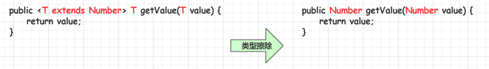

[JavaSE强化教程泛型，由点到面的讲解了整个泛型体系。_哔哩哔哩_bilibili](https://www.bilibili.com/video/BV1xJ411n77R?spm_id_from=333.788.videopod.episodes&vd_source=796ed40051b301bfa3a84ba357f4828c)

## 一. 什么是泛型

### 1. 背景

JAVA推出泛型以前，程序员可以构建一个元素类型为Object的集合，该集合能够存储任意的数据类型对象，而在使用该集合的过程中，需要程序员明确知道存储每个元素的数据类型，否则很容易引发ClassCastException异常。

eg:

```java
ArrayList list = new ArrayList();
list.add("java");
list.add(100);
list.add(true);

for (int i = 0; i < list.size(); i++) {
    Object o = list.get(i);
    String str = (String)o;
    System.out.println(str);
}
```

```shell
java
Exception in thread "main" java.lang.ClassCastException: class java.lang.Integer cannot be cast to class java.lang.String (java.lang.Integer and java.lang.String are in module java.base of loader 'bootstrap')
	at com.xi.demo01.MainClass.main(MainClass.java:20)
```

### 2. 泛型的概念

Java泛型（generics）是JDK5中引入的一个新特性，泛型提供了编译时类型安全监测机制，该机制允许我们在**编译时检测到非法的类型数据结构**。

**泛型的本质就是参数化类型**，也就是所操作的数据类型被指定为一个参数。

```java
ArrayList<String> strList = new ArrayList<>();
strList.add("a");
// strList.add(1); // 编译器检查 报错
strList.add("b");
strList.add("c");
for (int i = 0; i < strList.size(); i++) {
    String s = strList.get(i);
    System.out.println(s);
}
```

```shell
a
b
c
```

### 3. 泛型的好处

1. 类型安全
2. 消除了强制类型的转换

## 二. 泛型类、接口

### 1. 泛型类

- 泛型类的**定义语法**:
  ```java
  class 类名称 <泛型标识，泛型标识，…> {
    private 泛型标识 变量名; 
    .....
  }
  ```

- 常用的**泛型标识**：`T`、`E`、`K`、`V`

- 使用**语法**:
  ```java
  类名<具体的数据类型> 对象名 = new 类名<具体的数据类型>();
  ```

- Java**1.7以后**，**后面的<>**中的具体的数据类型**可以省略**不写
  ```java
  类名<具体的数据类型> 对象名 = new 类名<>();
  ```

eg: 泛型类的定义

```java
public class Generic<T> {
    //  T 是由外部使用类的时候来指定
    private T key;
    public Generic(T key) {
        this.key = key;
    }
    @Override
    public String toString() {
        return "Generic{" +
                "t=" + key +
                '}';
    }
    public T getKey() {
        return key;
    }
    public void setKey(T key) {
        this.key = key;
    }
}
```

```java
// 续上 main方法内
// 泛型类在创建对象的时候，来指定操作的具体数据类型。 Java1.7以后，后面的<>中的具体的数据类型可以省略不写
Generic<String> strGeneric = new Generic<>("abc");
String key1 = strGeneric.getKey();
System.out.println("key1 = " + key1); // key1 = abc

Generic<Integer> intGeneric = new Generic<>(100);
int key2 = intGeneric.getKey();
System.out.println("key2 = " + key2); // key2 = 100
```

### 2. 泛型类注意事项

1. 泛型类，如果**没有指定**具体的数据**类型**，此时，**操作类型是`Object`**
2. 泛型的**类型参数**只能是**类类型**，**不能是基本数据类型**
3. 泛型类型在**逻辑上**可以看成是**多个不同的类型**，但**实际上**都是**相同类型**

```java
// 续上 main方法内
// 泛型类在创建对象的时候，没有指定类型，将按照Object类型来操作。
Generic generic = new Generic("ABC");
Object key3 = generic.getKey();
System.out.println("key3:" + key3);

// 泛型类，不支持基本数据类型。
// Generic<int> generic1 = new Generic<int>(100); // 报错

// 同一泛型类，根据不同的数据类型创建的对象，本质上是同一类型。
System.out.println(intGeneric.getClass()); // class com.xi.demo02.Generic
System.out.println(strGeneric.getClass()); // class com.xi.demo02.Generic
System.out.println(intGeneric.getClass() == strGeneric.getClass()); // true
```

**案例：模拟公司年终抽奖  双奖池：实物奖池\<String> 和 现金奖池\<Integer>:**

```java
public class ProductGetter<T> {
    Random random = new Random();
    // 奖品
    private T product;
    // 奖品池
    ArrayList<T> list = new ArrayList<>();
    /**
     * 添加奖品
     * @param t
     */
    public void addProduct(T t) {
        list.add(t);
    }
    /**
     * 抽奖
     * @return
     */
    public T getProduct() {
        product = list.get(random.nextInt(list.size()));
        return product;
    }
}
```

```java
// 泛型类型在逻辑上可以看成是多个不同的类型，但实际上都是相同类型
public static void main(String[] args) {
    // 物品奖池
    ProductGetter<String> itemProductGetter = new ProductGetter<>();
    // 物品奖品
    String[] itemProducts = {"苹果手机", "华为手机", "扫地机器人", "咖啡机"};
    // 将物品奖品添加到物品奖池
    for (int i = 0; i < itemProducts.length; i++) {
        itemProductGetter.addProduct(itemProducts[i]);
    }
    // 抽取物品
    String itemProduct = itemProductGetter.getProduct();
    System.out.printf("实物奖池：\n  恭喜您，抽中了%s\n", itemProduct);

    System.out.println("------------------------");

    // 现金奖池
    ProductGetter<Integer> moneyProductGetter = new ProductGetter<>();
    // 现金奖品金额
    int[] moneyProducts = {5000, 10000, 30000, 50000, 100000};
    // 将现金奖品添加到现金奖池
    for (int i = 0; i < moneyProducts.length; i++) {
        moneyProductGetter.addProduct(moneyProducts[i]);
    }
    // 抽取现金
    int moneyProduct = moneyProductGetter.getProduct();
    System.out.printf("现金奖池：\n  恭喜你抽中 %s￥ 现金大奖", moneyProduct);
}
```

```shell
实物奖池：
  恭喜您，抽中了扫地机器人
------------------------
现金奖池：
  恭喜你抽中 100000￥ 现金大奖
```

### 3. 从泛型类派生子类

1. 泛型类派生子类，**子类也是泛型类**，子类和父类的泛型类型**要一致**

   ```java
   class ChildGeneric<T> extends Generic<T> 
   ```

2. 泛型类派生子类，**子类不是泛型类**，**父类要明确**泛型的数据类型

   ```java
   class ChildGeneric extends Generic<String>
   ```

eg:

父类，泛型类：

```java
public class Parent<E> {
    private E value;

    public E getValue() {
        return value;
    }

    public void setValue(E value) {
        this.value = value;
    }
}
```

子泛型类1：

```java
// 泛型类派生子类，子类也是泛型类，子类和父类的泛型类型要一致
public class ChildFirst<T> extends Parent<T>{
// 子类也可以包含多个泛型，但必须包含所有的父类泛型
// public class ChildFirst<T， K, V> extends Parent<T>{
    @Override
    public T getValue() {
        return super.getValue();
    }
}
```

子非泛型类2：

```java
// 泛型类派生子类，子类不是泛型类，父类要明确泛型的数据类型
public class ChildSecond extends Parent<Integer>{
    @Override
    public Integer getValue() {
        return super.getValue();
    }
}
```

main方法：

```java
public static void main(String[] args) {
    ChildFirst<String> childFirst = new ChildFirst<>();
    childFirst.setValue("abc");
    String value = childFirst.getValue();
    System.out.println("value = " + value);

    ChildSecond childSecond = new ChildSecond();
    childSecond.setValue(100);
    int value1 = childSecond.getValue();
    System.out.println("value1 = " + value1);
}
```

```shell
value = abc
value1 = 100
```

### 4. 泛型接口

泛型接口的**定义语法：**

```java
interface 接口名称 <泛型标识，泛型标识，…> {
  泛型标识 方法名(); 
  .....
}
```

### 5. 泛型接口的使用

- **实现类不是泛型类**，**接口要明确**数据**类型**
- **实现类也是泛型类**，实现类和接口的泛型**类型要一致**

泛型接口：

```java
public interface Generator<T> {
    T getKey();
}
```

实现类非泛型类 实现泛型接口：

```java
//  实现泛型接口的类，不是泛型类，需要明确实现泛型接口的数据类型
public class Apple implements Generator<String> {
    @Override
    public String getKey() {
        return "hello generic";
    }
}
```

实现类泛型类 实现泛型接口：

```java
// 泛型接口的实现类，是一个泛型类，那么要保证实现接口的泛型类泛型标识包含泛型接口的泛型标识
public class Pair<T, E> implements Generator<T> {
    private T key;
    private E value;

    public Pair(T key, E value) {
        this.key = key;
        this.value = value;
    }

    @Override
    public T getKey() {
        return key;
    }

    public E getValue() {
        return value;
    }
}
```

main方法：

```java
public static void main(String[] args) {
    Apple apple = new Apple();
    String key = apple.getKey();
    System.out.println("key = " + key);

    System.out.println("----------------------");

    Pair<String, Integer> pair = new Pair<>("count", 100);
    String key1 = pair.getKey();
    System.out.println("key1 = " + key1);
    int value1 = pair.getValue();
    System.out.println("value1 = " + value1);
}
```

```shell
key = hello generic
----------------------
key1 = count
value1 = 100
```

## 三. 泛型方法

**泛型类：**是在实例化类的时候指明泛型的具体类型

**泛型方法：**是在调用方法的时候指明泛型的具体类型

### 1. 语法

```java
修饰符 <T，E, ...> 返回值类型 方法名(形参列表) {
    方法体...
}
```

- `public`与返回值中间`<T>`非常重要，可以理解为声明此方法为泛型方法。
- 只有声明了`<T>`的方法才是泛型方法，泛型类中的使用了泛型的成员方法并不是泛型方法。
- `<T>`表明该方法将使用泛型类型`T`，此时才可以在方法中使用泛型类型`T`。
- 与泛型类的定义一样，此处T可以随便写为任意标识，常见的如`T`、`E`、`K`、`V`等形式的参数常用于表示泛型。

### 2. 泛型方法与可变参数

**可变参数语法：**

```java
public <E> void print(E... e){
    for (E e1 : e) {
        System.out.println(e);
    }
}
```

eg:

模拟公司抽奖

```java
public class ProductGetter<T> {
    Random random = new Random();
    // 奖品
    private T product;
    // 奖品池
    ArrayList<T> list = new ArrayList<>();
    /**
     * 添加奖品
     * @param t
     */
    public void addProduct(T t) {
        list.add(t);
    }
    /**
     * 抽奖 成员方法 非泛型方法
     * @return
     */
    public T getProduct() {
        product = list.get(random.nextInt(list.size()));
        return product;
    }
    /**
     * 抽奖 泛型方法 可以抽取不同于泛型类指定类型的奖品
     * @param list 参数
     * @param <T> 泛型标识，具体类型，由调用方法的时候来指定
     * @return
     */
    public <T> T getProduct(ArrayList<T> list) {
        return list.get(random.nextInt(list.size()));
    }
    /**
     * 静态的泛型方法，采用多个泛型类型
     */
    public static <T, E, K> void printType(T t, E e, K k) {
        System.out.println(t + "\t" + t.getClass().getSimpleName());
        System.out.println(e + "\t" + e.getClass().getSimpleName());
        System.out.println(k + "\t" + k.getClass().getSimpleName());
    }
    
    /**
     * 泛型可变参数的定义
     */
    public static <E> void print(E... e) {
        for (int i = 0; i < e.length; i++) {
            System.out.println(e[i] + "\t" + e[i].getClass().getSimpleName());
        }
    }
}
```

```java
public static void main(String[] args) {
    // 创建泛型类
    ProductGetter<Integer> productGetter = new ProductGetter<>();
    
    // 使用非泛型方法只能抽取和泛型类同一个泛型的物品
    int[] products = {100, 200, 400};
    for (int i = 0; i < products.length; i++) {
        productGetter.addProduct(products[i]);
    }
    // 泛型类成员方法的调用
    int product = productGetter.getProduct();
    System.out.println("product = " + product);

    System.out.println("-------------------------");

    // 使用泛型方法，可以抽取不同于泛型类的泛型类型的奖品
    ArrayList<String> strList = new ArrayList<>();
    strList.add("笔记本电脑");
    strList.add("手机");
    strList.add("扫地机器人");
    // 泛型方法的调用，类型是通过调用方法的时候来指定的
    String product1 = productGetter.getProduct(strList);
    System.out.println(product1 + "\t" + product1.getClass().getSimpleName()); // 手机	String

    ArrayList<Integer> intList = new ArrayList<>();
    intList.add(1000);
    intList.add(3000);
    intList.add(5000);
    intList.add(10000);
    Integer product2 = productGetter.getProduct(intList);
    System.out.println(product2 + "\t" + product2.getClass().getSimpleName()); // 3000	Integer
    // 调用多个类型的泛型方法
	ProductGetter.printType(100, "java", true); // 100	Integer
												// java	String
												// true	Boolean
    // 可变参数的泛型方法调用
    ProductGetter.print(1, 2, 3); // 1	Integer
    							  // 2	Integer
    						      // 3	Integer
    ProductGetter.print(1, 2, "a", "b"); // 1	Integer
										 //	2	Integer
										 //	a	String
										 //	b	String
}
```

### 3. 泛型方法总结

- **泛型方法能使方法独立于类而产生变化**
- 如果**`static`方法**要**使用泛型能力**，就**必须使其成为泛型方法**

## 四. 类型通配符

### 1. 类型通配符的概念

- 类型通配符一般是使用`?`代替具体的类型实参。
- 类型通配符是类型实参，而不是类型形参

```java
public class Box<E> {
    private E first;

    public E getFirst() {
        return first;
    }

    public void setFirst(E first) {
        this.first = first;
    }
}
```

```java
public static void main(String[] args) {
    Box<Number> box1 = new Box<>();
    box1.setFirst(100);
    showBox(box1);

    Box<Integer> box2 = new Box<>(); // Integer extends Number
    box2.setFirst(200);
    showBox(box2);
}

public static void showBox(Box<?> box) {
    Object first = box.getFirst();
    System.out.println("first = " + first);
}

// 报错 泛型不支持重载 以下两个方法被认为是相同方法，参数都是Box，报错
// 如果只保留showBox(Box<Number>)方法，则上面的box2报错，泛型不支持多态，指定Number就必须放number不可以放子类或其他相关类型
/*
    public static void showBox(Box<Number> box) {
        Number first = box.getFirst();
        System.out.println("first = " + first);
    }

    public static void showBox(Box<Integer> box) {
        Number first = box.getFirst();
        System.out.println("first = " + first);
    }
*/
```

### 2. 类型通配符的上限

**语法：**

```java
类/接口<? extends 实参类型>
```

要求该泛型的类型，只能是**实参**类型，**或实参**类型**的子类**类型

Box类见上

```java
public static void main(String[] args) {
    Box<Number> box1 = new Box<>();
    box1.setFirst(100);
    showBox(box1);

    Box<Integer> box2 = new Box<>();
    box2.setFirst(200);
    showBox(box2);
}
public static void showBox(Box<? extends Number> box) {
    Number first = box.getFirst();
    System.out.println("first = " + first);
}
```

例：

```java
public class Animal {
}
public class Cat extends Animal{
}
public class MinCat extends Cat {
}
```

```java
public static void main(String[] args) {
    ArrayList<Animal> animals = new ArrayList<>();
    ArrayList<Cat> cats = new ArrayList<>();
    ArrayList<MinCat> minCats = new ArrayList<>();

    // cats.addAll(animals); // 报错 该方法中指定上限为Cat类 ArrayList<E>.addAll(Collection<? extends E> c)
    cats.addAll(cats);
    cats.addAll(minCats);

    // showAnimal(animals); // 报错 指定上限为Cat类
    showAnimal(cats);
    showAnimal(minCats);
}

/**
 * 泛型上限通配符
 * 传递的集合类型只能是 Cat及其子类
 *  可以安全地从 list 中读取元素，您可以将元素当作 Cat 类型处理。
 *  不能向 list 中添加元素，除了 null。这是因为编译器不知道 list 实际上是什么类型（是 Cat 还是 MinCat），因此无法保证添加的元素是类型安全的。
 * @param list
 */
public static void showAnimal(ArrayList<? extends Cat> list) {
    // 使用泛型上限通配符不能够填充元素
    // list.add(new Cat()); // 报错
    // list.add(new MinCat()); // 报错
    // list.add(new Animal()); // 报错
    list.add(null);

    for (int i = 0; i < list.size(); i++) {
        Cat cat = list.get(i);
        System.out.println(cat);
    }
}
```

```shell

```

### 3. 类型通配符的下限

语法：

```java
类/接口<? super 实参类型>
```

要求该泛型的类型，只能是**实参**类型，**或实参**类型**的父类**类型。

```java
public static void main(String[] args) {
    ArrayList<Animal> animals = new ArrayList<>();
    ArrayList<Cat> cats = new ArrayList<>();
    ArrayList<MinCat> minCats = new ArrayList<>();

    // addAll方法使用的是上限通配符 ArrayList<E>.addAll(Collection<? extends E> c)
    //         cats.addAll(animals); // 报错 该方法中指定上限为Cat类 只能add Cat及子类
    cats.addAll(cats);
    cats.addAll(minCats);

    showAnimal(animals);
    showAnimal(cats);
    //        showAnimal(minCats); // 报错 指定下限为Cat类

}

/**
 * 泛型下限通配符
 * 传递的集合类型只能是 Cat及其父类
 * @param list
 */
public static void showAnimal(ArrayList<? super Cat> list) {
    // list.add(new Animal()); // 报错 ArrayList<E>.add(E e) 向后兼容，限制上限，可以添加E及子类
    list.add(new Cat());
    list.add(new MinCat());

    for (int i = 0; i < list.size(); i++) {
        Object o = list.get(i);
        System.out.println(o);
    }
}
```

**jdk 中下限通配符的使用(eg:TreeSet)：**

> 1. `public TreeSet(Comparator<? super E> comparator) {` jdk中TreeSet指定比较器的构造方法
> 2. `class Comparator2 implements Comparator<Cat> {` 自定义的比较器对象
> 3. `TreeSet<MinCat> treeSet = new TreeSet<>(new Comparator2());` 创建TreeSet集合时指定比较器
>
> 可以转化为(b可以是a或a的父类)：
>
> 1. `public TreeSet(Comparator<b super a> comparator) {` jdk中TreeSet指定比较器的构造方法
> 2. `class Comparator2 implements Comparator<b> {` 比较器对象
> 3. `TreeSet<a> treeSet = new TreeSet<a>(new Comparator2());` 创建TreeSet集合时指定比较器
>
> 即构造方法创造出来的TreeSet对象是比较器泛型或比较器泛型的子类
>
> 这样就保证不会出现比较器比较时出现比较器泛型的父类而没有比较器泛型独有的某个属性的情况

```java
public class TestEg {
    public static void main(String[] args) {
        // TreeSet(Comparator<? super E> comparator) 创建TreeSet集合时指定比较器 下限通配符，只能是实参及实参的父类
//        TreeSet<Cat> treeSet = new TreeSet<>(new Comparator2()); // 根据Cat的age比较
//        TreeSet<Cat> treeSet = new TreeSet<>(new Comparator1()); // 根据Animal的name比较
        TreeSet<MinCat> treeSet = new TreeSet<>(new Comparator3()); // 根据MinCat的level比较 报错，泛型不能是MinCat的父类Cat
        
//        treeSet.add(new Cat("jerry", 3));
//        treeSet.add(new Cat("amy", 4));
//        treeSet.add(new Cat("frank", 5));
//        treeSet.add(new Cat("jim", 2));
        treeSet.add(new MinCat("a", 1, 2));
        treeSet.add(new MinCat("b", 3, 4));
        treeSet.add(new MinCat("c", 2, 1));

        for (Cat cat : treeSet) {
            System.out.println(cat);
        }
    }
}


class Comparator1 implements Comparator<Animal> {

    // 根据animal的name比较
    @Override
    public int compare(Animal o1, Animal o2) {
        return o1.name.compareTo(o2.name);
    }
}

class Comparator2 implements Comparator<Cat> {
    // 根据cat的age比较
    @Override
    public int compare(Cat o1, Cat o2) {
        return o1.age - o2.age;
    }
}

class Comparator3 implements Comparator<MinCat> {
    // 根据mincat的level比较
    @Override
    public int compare(MinCat o1, MinCat o2) {
        return o1.level - o2.level;
    }
}
```

## 五. 类型擦除

### 1. 类型擦除的概念

泛型是Java 1.5版本才引进的概念，在这之前是没有泛型的，但是，泛型代码能够很好地和之前版本的代码兼容。那是因为，泛型信息只存在于代码编译阶段，在进入JVM之前，与泛型相关的信息会被擦除掉，我们称之为--类型擦除。

```java
ArrayList<Integer> intList = new ArrayList<>();
ArrayList<String> strList = new ArrayList<>();

System.out.println(intList.getClass().getSimpleName()); // ArrayList
System.out.println(strList.getClass().getSimpleName()); // ArrayList

System.out.println(intList.getClass() == strList.getClass()); // true
```

### 2. 无限制类型擦除

无限制类型擦除**按Object类型进行擦除**


```java
public class Erasure<T> {
    private T key;
    public T getKey() {
        return key;
    }
    public void setKey(T key) {
        this.key = key;
    }
}
```

```java
public static void main(String[] args) {
    Erasure<Integer> erasure = new Erasure<>();
    // 利用反射，返回Erasure类的字节码文件的Class类对象
    Class<? extends Erasure> clz = erasure.getClass();
    // 获取所有的成员变量
    Field[] declaredFields = clz.getDeclaredFields(); // 获取所有字段
    // 遍历所有成员变量
    for (Field declaredField : declaredFields) {
        // 打印成员变量的名称和类型
        System.out.println(declaredField.getName() + ":" + declaredField.getType().getSimpleName()); // T
    }
}
```

```shell
key:Object
```

### 3. 有限制类型擦除

有限制类型擦除**按上限类型进行擦除**


```java
public class Erasure<T extends Number> {
    private T key;
    public T getKey() {
        return key;
    }
    public void setKey(T key) {
        this.key = key;
    }
}
```

```java
public static void main(String[] args) {
    Erasure<Integer> erasure = new Erasure<>();
    // 利用反射，返回Erasure类的字节码文件的Class类对象
    Class<? extends Erasure> clz = erasure.getClass();
    // 获取所有的成员变量
    Field[] declaredFields = clz.getDeclaredFields(); // 获取所有字段
    // 遍历所有成员变量
    for (Field declaredField : declaredFields) {
        // 打印成员变量的名称和类型
        System.out.println(declaredField.getName() + ":" + declaredField.getType().getSimpleName()); // T
    }
}
```

```shell
key:Number
```

### 4. 擦除方法中类型定义的参数



```java
public class Erasure<T extends Number> {
    private T key;
    public T getKey() {
        return key;
    }
    public void setKey(T key) {
        this.key = key;
    }
    /**
     * 泛型方法
     * @return
     * @param <T>
     */
    public <T extends List> T show(T t) {
        return t;
    }
}
```

```java
public static void main(String[] args) {
    Erasure<Integer> erasure = new Erasure<>();
    // 利用反射，返回Erasure类的字节码文件的Class类对象
    Class<? extends Erasure> clz = erasure.getClass();
	// 获取所有的成员方法
    Method[] declaredMethods = clz.getDeclaredMethods();
    // 遍历所有成员方法
    for (Method declaredMethod : declaredMethods) {
        // 打印成员方法的名称和返回值类型
        System.out.println(declaredMethod.getName() + ":" + declaredMethod.getReturnType().getSimpleName());
    }
}
```

控制台

```shell
getKey:Number
setKey:void
show:List
```

### 5. 桥接方法


```java
public interface Info<T> {
    T info(T t);
}
```

```java
public class InfoImpl implements Info<Integer> {
    @Override
    public Integer info(Integer value) {
        return value;
    }
}
```

```java
public static void main(String[] args) {
    // 拿到InfoImpl的字节码文件
    Class<InfoImpl> infoClass = InfoImpl.class;
    // 获取所有的成员方法
    Method[] infoImplMethods = infoClass.getDeclaredMethods();
    // 遍历所有成员方法
    for (Method method : infoImplMethods) {
        // 打印成员方法的名称和返回值类型
        System.out.println(method.getName() + ":" + method.getReturnType().getSimpleName());
    }
}
```

控制台：
```shell
info:Integer
info:Object
```

`Object info()`方法就是桥接方法，保持接口和类的实现关系，重写接口的抽象方法

## 六. 泛型和数组

### 1. 泛型数组的创建

- 可以声明带泛型的数组引用，但是不能直接创建带泛型的数组对象
- 可以通过`java.lang.reflect.Array`的`newInstance(Class<T>,int)`创建`T[]`数组

**在开发过程中尽量不要使用泛型数组，在实际开发中使用泛型集合代替泛型数组**，因为泛型数组在运行时类型擦除，无法确定泛型类型，所以无法进行类型检查

创建方式：

```java
// ArrayList<String>[] listArr = new ArrayList<>[5]; // 报错
/*
  // 使用数组时不要把原生数组暴露出来
  ArrayList[] lists = new ArrayList[5];
  ArrayList<String>[] listArr = lists;
*/
ArrayList<String>[] listArr = new ArrayList[5];

String[] strs = (String[]) Array.newInstance(String.class, 5);
ArrayList<String>[] arrays = (ArrayList<String>[]) Array.newInstance(ArrayList.class, 5);
```

eg：

```java
public class Fruit<T> {
    private T[] arrays;

    public Fruit(Class<T> clz, int length) {
        // 通过Array.newInstance创建泛型数组
        arrays = (T[])Array.newInstance(clz, length);
    }
    /**
     * 填充数组
     * @param index
     * @param item
     */
    public void put(int index, T item) {
        arrays[index] = item;
    }
    /**
     * 获取数组中的元素
     * @param index
     * @return
     */
    public T get(int index) {
        return arrays[index];
    }
    public T[] getArrays() {
        return arrays;
    }
}
```

```java
public static void main(String[] args) {
    Fruit<String> fruit = new Fruit<>(String.class, 3);
    fruit.put(0, "苹果");
    fruit.put(1, "香蕉");
    fruit.put(2, "橘子");
    System.out.println(Arrays.toString(fruit.getArrays())); // [苹果, 香蕉, 橘子]
    System.out.println(fruit.get(2)); // 橘子
}
```

## 七. 泛型和反射

### 反射常用的泛型类

- `Class<T>`
- `Constructor<T>`

```java
public static void main(String[] args) throws Exception {
    /*
        // 获取Person字节码文件
        Class personClass = Person.class;
        // 获取构造函数
        Constructor constructor = personClass.getConstructor();
        // 创建对象
        Person person = (Person) constructor.newInstance();
    */

    // 获取Person字节码文件
    Class<Person> personClass = Person.class;
    // 获取构造函数
    Constructor<Person> constructor = personClass.getConstructor();
    // 创建对象
    Person person = constructor.newInstance();
}
```

